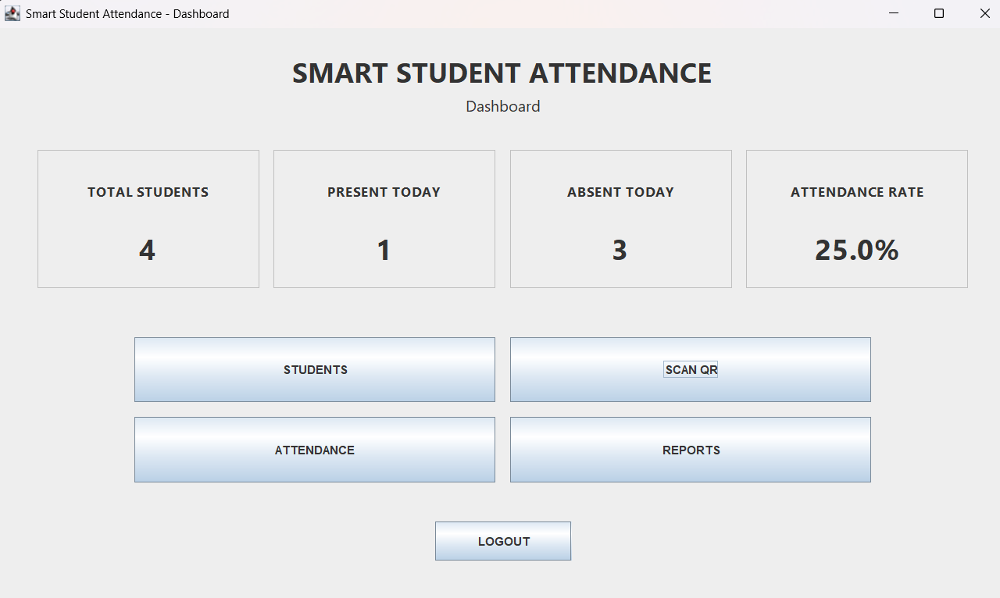
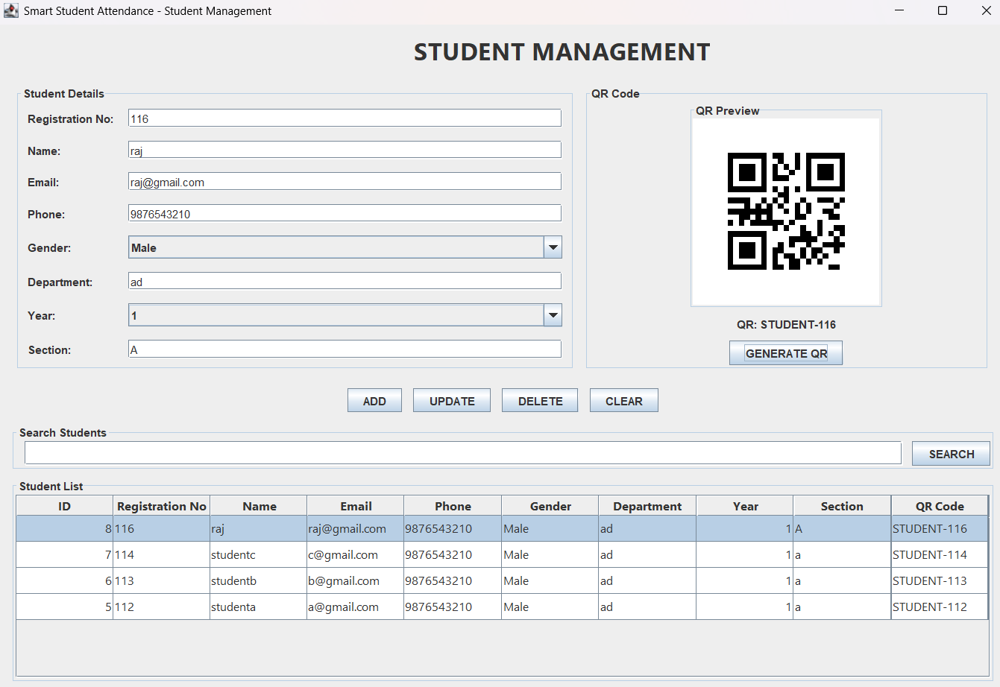
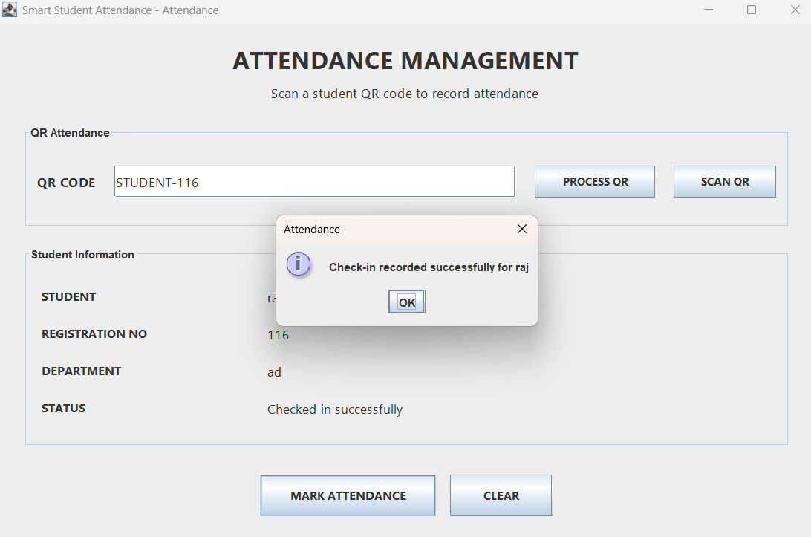
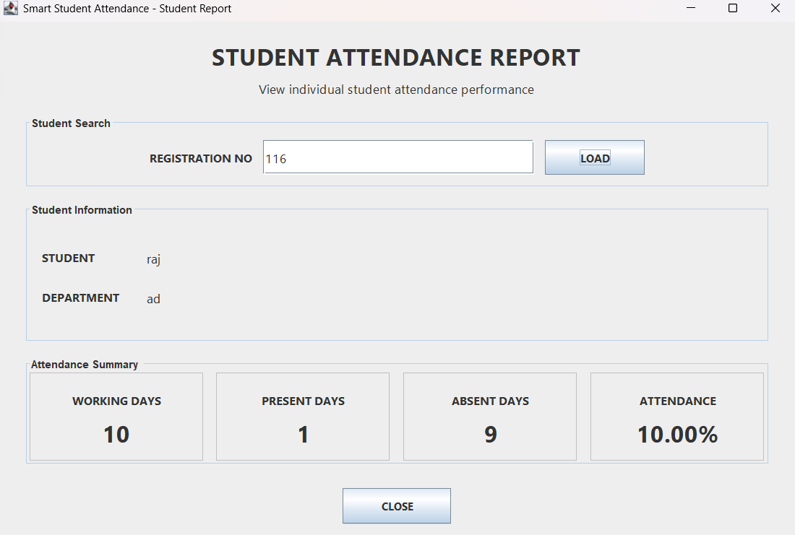

# Smart Student Attendance Management System

A Java Swing desktop application for managing student records and recording attendance through QR codes, with dashboard analytics, working-day-aware calculations, academic-calendar support, and student-level attendance reports.

## Overview

The system provides a complete attendance workflow:

```text
Login
  ↓
Student Management
  ↓
QR Generation
  ↓
QR Scan / Manual QR Processing
  ↓
Check-in / Check-out
  ↓
Attendance History
  ↓
Analytics & Student Reports
  ↓
Academic Calendar Support
```

## Features

- Login authentication with SHA-256 password hashing
- Student registration and CRUD management
- QR-code generation for students
- Webcam-based QR scanning
- Attendance check-in and check-out
- One attendance record per student per day
- Attendance history with date filtering
- Dashboard metrics for total students, present/absent counts, and attendance rate
- Working-day-aware attendance calculations
- Individual student attendance reports
- Academic calendar management for working/non-working days
- MySQL database with relational student/attendance/calendar data
- Test and demonstration classes covering attendance, QR, camera, calendar, and analytics components

## Technology Stack

- **Java 23**
- **Java Swing**
- **MySQL**
- **JDBC**
- **ZXing** for QR processing
- **Webcam Capture** for camera-based scanning
- **NetBeans / Ant** project structure

## Architecture

```text
┌──────────────────────────────┐
│        Swing UI Layer        │
│ Login • Dashboard • Students│
│ Attendance • Reports •       │
│ Academic Calendar            │
└──────────────┬───────────────┘
               ↓
┌──────────────────────────────┐
│       Service Layer          │
│ Attendance • Analytics       │
└──────────────┬───────────────┘
               ↓
┌──────────────────────────────┐
│          DAO Layer           │
│ Student • User • Attendance  │
│ Calendar                     │
└──────────────┬───────────────┘
               ↓
┌──────────────────────────────┐
│        MySQL Database        │
│ Users • Students • Attendance│
│ Academic Calendar            │
└──────────────────────────────┘
```

## Key Screens

### Dashboard



The dashboard summarizes current attendance activity and exposes the main workflows.

### Student Management + QR



Student details can be created, updated, deleted, searched, and associated with a generated QR code.

### QR Attendance



QR data can be scanned or processed to identify a student and record attendance.

### Student Attendance Report



The report view calculates working days, present days, absent days, and the resulting attendance percentage for an individual student.

Additional screenshots are available in the `screenshots/` directory.

## Project Structure

```text
smart-student-attendance-management-system/
├── src/
│   ├── config/
│   ├── dao/
│   ├── model/
│   ├── service/
│   ├── ui/
│   ├── util/
│   └── test/
├── database/
├── config/
├── lib/
├── screenshots/
├── build.xml
├── manifest.mf
├── .gitignore
└── README.md
```

## Database Setup

1. Install MySQL and create/start the MySQL server.
2. Run `database/smart_student_attendance.sql` to create the database and tables.
3. Copy `config/db.properties.example` to `config/db.properties`.
4. Set your local `DB_URL`, `DB_USERNAME`, and `DB_PASSWORD` values.
5. Optionally run `database/create_admin.sql` after replacing `CHANGE_ME_BEFORE_RUN` with a local development password.

The real `config/db.properties` file is intentionally ignored by Git.

## Running the Application

### NetBeans

1. Open the project in NetBeans.
2. Use a Java 23 JDK.
3. Verify the local database configuration.
4. Run the project using the configured main class.

### Ant

A NetBeans-generated Ant build is included. Use the generated build targets from a Java 23 environment.

## Configuration and Security

This repository does **not** contain production credentials or a ready-to-use local database configuration. Database credentials are supplied through `config/db.properties` or environment variables.
Passwords are currently hashed with SHA-256 for this educational project. A production authentication system should use a password-specific hashing algorithm such as PBKDF2, bcrypt, or Argon2 with appropriate parameters.

Do not commit:

- Real database passwords
- Personal student information
- Local generated QR images
- Build/dist output
- NetBeans private metadata

## Testing

The repository includes Java test and demonstration classes covering areas including:

- Attendance behavior
- Attendance history
- Attendance services
- QR generation and scanning
- Camera initialization
- Academic calendar behavior
- Analytics calculations

These classes are currently implemented as executable Java test/demo programs rather than a JUnit-based automated test suite.

## Project Highlights

- Designed a layered Java application instead of placing database logic directly in UI forms.
- Integrated QR-based attendance with a webcam scanning workflow.
- Added working-day-aware analytics so attendance percentages are based on configured academic working days.
- Added student-level attendance reporting for easier performance review.
- Added a configurable database connection mechanism so local credentials are not embedded in source code.

## Repository / Distribution Notes

The source repository is intended for code review and portfolio presentation. A runnable distribution can be provided separately through a GitHub Release once a Java 23 build has been produced and the local MySQL setup instructions are followed.

## License

No open-source license is included at this time. The repository is published for portfolio and educational demonstration purposes; reuse should not be assumed without permission from the author.
